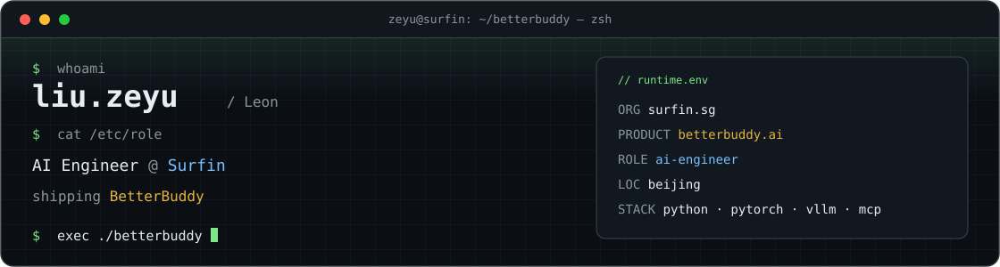

<!--
  liuzeyu4201
  AI Engineer @ Surfin · BetterBuddy
-->

<p align="center">
  
</p>

<p align="center">
  <a href="https://www.surfin.sg/page/home"></a>
  <a href="https://www.betterbuddy.ai"></a>
  
  
  <a href="mailto:liuzeyu4201@gmail.com"></a>
</p>

```bash
# ~/.profile
export NAME="Liu Zeyu (Leon)"
export ROLE="AI Engineer"
export ORG="Surfin"
export PRODUCT="BetterBuddy"
```

## $ ls ~/src

| repo | 一句话 |
| :--- | :--- |
| [KnowledgeBase-MCP](https://github.com/liuzeyu4201/KnowledgeBase-MCP) | 给 Agent 用的知识库：分类 / 导入 / 向量 + BM25 / MCP |
| [Figma-Engineer](https://github.com/liuzeyu4201/Figma-Engineer) | Figma → 代码，保住架构可扩展和设计一致性 |
| [NEXUS](https://github.com/liuzeyu4201/NEXUS) | 单机赛博朋克终端模拟器。纯离线虚构网络，不碰真实系统 |
| [algorithm-tools-platform](https://github.com/liuzeyu4201/algorithm-tools-platform) | 知识处理平台 |
| [tokencounter](https://github.com/liuzeyu4201/tokencounter) | VS Code 扩展：统计 prompt tokens |
| [AI-monitor](https://github.com/liuzeyu4201/AI-monitor) | 本地 AI 任务监视器（macOS） |

## $ which --stack

<p align="center">
  
</p>

```text
languages   Python · TypeScript · Swift
ai runtime  PyTorch · transformers · vLLM
agent       MCP · retrieval · tool-calling
web         FastAPI · Node
ops         Docker · Linux
```

## $ cat /proc/math

数学是底层 kernel，不是装饰。

```text
LOADED    数学分析  高等代数  实分析  泛函分析  点集拓扑  概率论
STALLED   抽象代数  复分析    常微分  偏微分方程
QUEUED    微分流形  黎曼几何  李群    表示论    交换代数  同调代数
```

## $ telemetry

<p align="center">
  
  
</p>

---

```text
mail     liuzeyu4201@gmail.com
org      https://www.surfin.sg/page/home
product  https://www.betterbuddy.ai
host     github.com/liuzeyu4201
```

<p align="center">
  <sub><code>exit 0</code> · still compiling.</sub>
</p>
