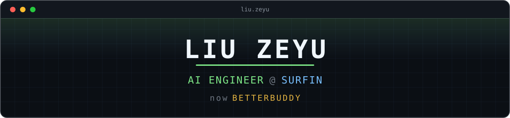

<!--
  liuzeyu4201
  AI Engineer @ Surfin · BetterBuddy
-->

<p align="center">
  
</p>

## $ whoami

```text
role      AI Engineer @ Surfin
building  BetterBuddy — AI Staff for a Better Business
```

<p align="center">
  <a href="https://www.surfin.sg/page/home"></a>
  <a href="https://www.betterbuddy.ai/"></a>
  <a href="mailto:liuzeyu4201@gmail.com"></a>
</p>

## $ which --stack

<p align="center">
  
</p>

```text
languages   Python · TypeScript · Swift
ai runtime  PyTorch · transformers · vLLM
agent       MCP · retrieval · tool-calling
web         FastAPI · Node
ops         Docker · Linux
```

## $ cat /proc/math

```text
algebra     linear algebra · abstract algebra · commutative algebra · homological algebra · representation theory
analysis    mathematical analysis · real analysis · complex analysis · functional analysis · ODE · PDE · probability
geometry    point-set topology · differential manifolds · Riemannian geometry · Lie groups
```

## $ telemetry

<p align="center">
  
  
</p>

---

<p align="center">
  <sub><code>exit 0</code> · still compiling.</sub>
</p>
